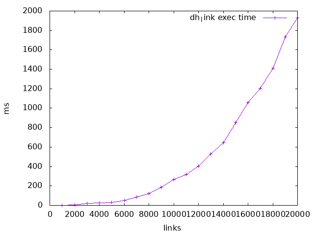
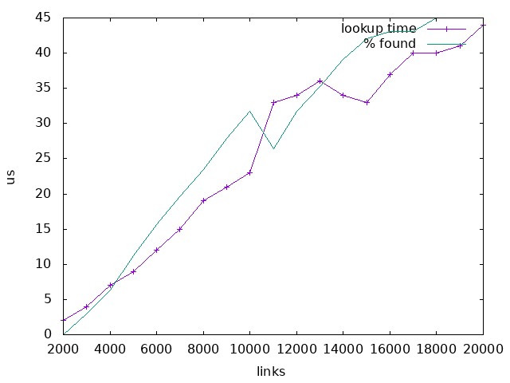

File System
===========

File System Abstraction
-----------------------

### General principles

In this part of the documentation terms vnode and inode might be sometimes
used interchangeably. Historically inode was a way to index files in the
Unix file system and like. While Zeke continues to use this terminology it
adds a concept of a vnode that is used as an abstraction level between
actual the file systems and the VFS.  This is implemented mostly the same
way as in most of modern Unices today.

Another important term often used in the context of Zeke’s VFS is the
superblock, it’s roughly an abstraction of an accessor to the meta data
or allocation table(s) of a physical (or virtual) file system. For example
for FAT this means that every volume has a superblock in Zeke and the
superblock can be used to access the file allocation table and other
label data of that volume.

In Zeke vnodes are always used as the primary access method to the files
in a file system, inodes are only accessed internally within the file
system implementation code if the file system supports/uses inodes.
Expected behavior is that a vnode and a vnode number exist in the system
as long as any process owns a reference to that vnode. After there are
no more references to a vnode it’s not guaranteed that the vnode exist
in memory and it cannot be retrieved by its vnode number. In fact
normally vnodes can’t be accessed by their vnode number but a vnode
number is guaranteed to be unique within a single file system,
superblock + vnode, but same vnode might be in use within another file
system and the number can be also reused.

To help understanding how VFS works in Zeke, it can be simplistically
described as an object storage where file objects are first searched,
found and the associated (open) with a process. When a file is opened
the process owns a pointer to the file descriptor that contains some
state information and pointer to the actual file vnode. The vnode of
the file is itself an object that knows where contents of the file is
stored (physical file system, superblock pointer) and who knows how to
manipulate the data (pointer to the vnode operations struct). In fact
vnode number itself is pretty much redundant and legacy information for
Zeke that is only provided for compatibility reasons, the actual access
method is always by a pointer reference to an object.

### Kernel interface

The kernel interface to the actual file system drivers and file system
superblocks is built around virtual function structs defined in the VFS
header file `fs.h` and some user space header files defining unified
data types.

A new file system is first registered to the kernel by passing a pointer
to fs struct that is a complete interface for mounting a new superblock
and interacting with the file system (note the difference between a file
system (driver) and a file system superblock that is referencing to the
actual data storage, while fs driver is accessing the superblock. The
file system struct is shown in [\[list:fs\]](#list:fs).

When superblock is mounted a superblock struct pointer is returned. This
pointer servers as the main interface to the newly mounted file system.
Superblock is defined as in listing [\[list:fs\_sb\]](#list:fs_sb). By
using superblock function calls it’s possible to get direct references
to vnodes and vnode operations e.g. for modifying file contents or
adding new hard links to a directory node.

**fs struct definition.**

```c
/**
 * File system.
 */
typedef struct fs {
    char fsname[8];

    struct fs_superblock * (*mount)(const char * mpoint, uint32_t mode,
            int parm_len, char * parm);
    int (*umount)(struct fs_superblock * fs_sb);
    struct superblock_lnode * sbl_head; /*!< List of all mounts. */
} fs_t;
```

**superblock struct definition.**

```c
/**
 * File system superblock.
 */
typedef struct fs_superblock {
    fs_t * fs;
    dev_t dev;
    uint32_t mode_flags; /*!< Mount mode flags */
    vnode_t * root; /*!< Root of this fs mount. */
    char * mtpt_path; /*!< Mount point path */

    /**
     * Delete a vnode reference.
     * Deletes a reference to a vnode and destroys the inode corresponding to the
     * inode if there is no more links and references to it.
     * @param[in] vnode is the vnode.
     * @return Returns 0 if no error; Otherwise value other than zero.
     */
    int (*delete_vnode)(vnode_t * vnode);
} fs_superblock_t;
```

### VFS hash

`vfs_hash` is a hashmap implementation used for vnode caching of
physically slow file systems. VFS itself doesn’t use this caching for
anything, and thus compiling `vfs_hash` is optional but file systems are
allowed to require it.

\[FAT\]<span>File Allocation Table</span>

fatfs
-----

### Overall description

Fatfs driver is an implementation of the FAT file system in Zeke.

**Main features**

- FAT12/16/32,
- Supports multiple ANSI/OEM code pages including DBCS,
- LFN support in ANSI/OEM or Unicode.

Note that Microsoft Corporation holds a patent for LFN and commercial use might
be prohibitten or it may require a license form the company. Therefore it’s also
possible to disable LFN support in Zeke if required.

The complete documentation is available [here](fatfs/README.md).

procfs
------

TODO

ramfs
-----

### Overall description

The purpose of the ramfs is to provide a storage in RAM for temporary files.
This is important in user scope where there might be no other writable storage
medium available on some embedded platform. In addition to storage for
temporary files in user scope ramfs could be useful to store kernel files as
well, e.g. init can be unpacked from kernel to ramfs and then executed.

In the future ramfs code might be also useful for VFS caching, so that
changes to a slow medium could be stored in ramfs-like structure and synced
later.

Ramfs should implement the same VFS interface as any other regular file
system for Zeke. This ensures that the same POSIX compliant file
descriptor interface\[1\] can be used for files stored to ramfs as well
as to any other file system.

### Structure of ramfs

Data in Ramfs is organized by inodes, an inode can contain either a file
or directory entries, which means that an inode can be either a file or
directory. Maximum size of a mounted ramfs is limited by size of `size_t`
type. Maximum size of a file is limited by size of `off_t` type. Figure
[\[figure:inodes\]](#figure:inodes) shows a high level representation of
how inodes are organized and linked in ramfs to form directory tree with
files and directories.

Contents of a file is stored in blocks of memory that are dynamically
allocated on demand. Block size is selected per file so all blocks are
equal size and block pointer array (`in.data`) is expanded when new
blocks are allocated for a file. Figure [\[figure:file\]](#figure:file)
shows how memory is allocated for a file inode.

Directory in ramfs is stored similarly to a file but `in.dir` (union
with `in.data`) is now constant in size and it’s used as a hash table
which points to chains of directory entries (directory entry arrays). If
two files are mapped to a same chain by hash function then the
corresponding chain array is re-sized so that the new entry can be added
at the end of array. This means that lookup from a directory entry chain
is quite cache friendly and can usually avoid fragmentation in memory
allocation. Figure [\[figure:dir\]](#figure:dir) represents a directory
inode containing some directory entries.


**Mounted ramfs with some inodes.**


**Structure of a file stored in ramfs.**


**Directory containing some directory entries in ramfs**

### Time complexity and performance analysis

#### Mount

When a new ramfs superblock is mounted it’s appended to the end of the
global superblock list. Time complexity of this operation is \(O(n)\) as
there is no information about the last node in the list. However this is
not a major problem because new mounts happen relatively rarely and
other operations during the mounting process will take much more time
than traversing a super block list of any practical length. Those other
operations includes allocating memory for inode array, allocating memory
for inode pool and initializing some data structures etc.

#### Get vnode by vnode number

Index nodes are stored in contiguous array as shown in figure
[\[figure:inodes\]](#figure:inodes). This trivially means that a vnode
can be always fetched from mounted ramfs in \(O(1)\) time as it’s only a
matter of array indexing.

#### Lookup vnode by filename

File lookup on ramfs level is implemented only on single directory vnode
level and sub-directory lookup must be then implemented on VFS
level i.e. lookup function for a vnode can only lookup for entries in
the current directory vnode. A file lookup is made by calling
`vnode->vnode_ops->lookup()`.

Directory entries are stored in chained hash tables as shown in figure
[\[figure:dir\]](#figure:dir). It can be easily seen that usually a
chain array contains only a single entry and therefore lookup is
\(O(1)\). In sense a of performance and efficiency of a chain array with
length greater than zero is more complex. Trivially lookup from array is
of course \(O(n)\). What is interesting here is how CPU caching works
here. Even though directory entries are different in size they are all
stored in contiguous memory area and can be loaded to CPU cache very
efficiently, whereas many other data structures may lead to several
non-contiguous memory allocations that will pollute the caching and slow
down the lookup if there is only few entries. That being said the current
implementation of directory entry storage seems almost perfect solution
if amount of directory entries is moderate and hash functions is good
enough.

#### Data by vnode

Data stored in file inodes is accessed by calling
`vnode->vnode_ops->read()` and `vnode->vnode_ops->write()`. Arguments
for both contains a pointer to the vnode, offset where to start reading
or writing from, byte count and a pointer to a buffer. Data structuring
of a file vnode was illustrated in figure
[\[figure:file\]](#figure:file).

Pointer to a block of data by `offset` is calculated as shown in
equation [\[eqn:dpointer\]](#eqn:dpointer), where data is the data block
pointer array. Length of data pointer by the pointer is calculated as
shown in equation [\[eqn:dlen\]](#eqn:dlen).

```
\[\begin{aligned}
  \textrm{block} &=& \textrm{data} \left[ \frac{\textrm{offset} -
    (\textrm{offset} \& (\textrm{blksize} - 1))}{\textrm{blksize}}
    \right] \\
  \textrm{p}     &=& \textrm{block} \left[ \textrm{offset} \& (\textrm{blksize} - 1)
    \right] \label{eqn:dpointer} \\
  \textrm{len}  &=& \textrm{blocksize} - (\textrm{offset} \& (\textrm{blksize} - 1)) \label{eqn:dlen}\end{aligned}\]
```

#### Create a vnode

Normally when a new inode is created it can be taken from the inode pool
and inserted at empty location on inode array. Average case can be
considered to be \(O(1)\) then.

Lets consider a case where a new vnode is created and inserted to the
index node array but it’s already full. A call to `krealloc()` will be
issued and the worst case of reallocation of a memory location may
require to create a copy of the whole index node array to a new
location. This means that the worst case time complexity of a vnode
creation is relative to size of the array, so its
\(O(n)\).

#### Summary

**Summary of time complexity of ramfs functions.**<span label="table:complexity"></span>

| Function              | Average time complexity | Worst case time complexity |
| :-------------------- | :---------------------: | :------------------------: |
| mount                 |        \(O(n)\)         |          \(O(n)\)          |
| vnode by vnode number |        \(O(1)\)         |          \(O(1)\)          |
| vnode by filename     |        \(O(1)\)         |          \(O(n)\)          |
| data by vnode         |        \(O(1)\)         |          \(O(1)\)          |
| create a new vnode    |        \(O(1)\)         |          \(O(n)\)          |

### Performance testing

Automated performance tests were implemented the same way as unit tests.
Ramfs performance tests are in `test_ramfsperf.c` file.

#### Test results

#### Hard link operations

Performance of hard link operations is tested in `test_dehtableperf.c`.

Figure [\[figure:dhlink\_perf\]](#figure:dhlink_perf) shows performance
measurements from `test_link_perf()` test. In this test number of
randomly named nodes are added at every point and total time of adding
those links is measured. Name collisions are not handled but just
appended to the chain array. It seems that total time of `dh_link()`
calls is almost flat but it then starts to smoothly transform to
something that is almost linearly relative to the amount of links added.
Calls to `kmalloc()` and `krealloc()` seems to add some random behavior
to link times.

Lookup tests were performed with `test_lookup_perf()` test and
illustrated in figure
[\[figure:dhlookup\_perf\]](#figure:dhlookup_perf). The test works by
first adding certain amount of randomly named links and then trying to
lookup with another set of randomly selected names. Hit percentage is
named as "% found" in the plot and lookup time is the mean of 100 random
lookups. Lookup function seems to behave quite linearly even though
there is some quite strange deviation at some link counts.

Even though lookups seems to be in almost linear relationship with the
link count of the directory entry hash table it doesn’t mean lookups are
slow. Even with 20000 links average lookup takes only \(45\:\mu s\) and
it’s very rare to have that many directory entries in one directory.



**Directory entry hash table link performance.**



**Directory entry hash table lookup performance**

**File operations**

Performance tests for file operations were performed on the universal
target where kmalloc uses malloc instead of dynem block allocator, this
in fact may make some of the result unreliable.

**ramfs write/read performance**

| **Operation**             | Transfer speed (MB/s) |
| :------------------------ | --------------------: |
| **Single write (100 MB)** |                       |
| new file                  |   21.62               |
| existing file             | 1694.92               |
| read                      | 1098.90               |
| **Sequential writes**     |                       |
| new file                  |    9.06               |
| existing file             |  335.80               |
| read                      |  426.22               |

Write and read performance testing is somewhat biased by the underlying
kernel even though we have our own memory allocator in place. Actually
kmalloc may make things work even worse because it’s optimized for
different kind of suballocator that is not present on API level of
Linux. So I think this is a major cause for very poor memory allocation
and first pass write performance to the allocated blocks of memory,
although kmalloc it self is quite inefficient too.

### Suggestions for further development

#### Directories

Directory entry lookup tables (hash tables) could be made variable in
size. This would make use of directory entry chains less frequent and
greatly improve performance of large directories while still maintaining
small footprint for small directories containing only few entries. At
minimum this would only require a function pointer to the current hash
function in the inode. There is no need to store the size of current
hash table array in variable because it can be determined by comparing
the function pointer. So overhead of this improvement would be size of
`size_t` per directory and one more dereference per lookup.

devfs
-----

### Overal description

Devfs inherits ramfs and creates an abstraction layer between device
drivers and device driver abstraction layers. Essentially devfs creates
a file abstraction with vfs read() and write() functions that
communicates with the actual device driver.

### Device creation process

Device registration with devfs starts from static init function of a
subsystem, device detection routine or some other triggering method. The
device identification/creation function shall, by some way, create a
`dev_info` struct that describes the device and provides necessary
function pointers for reading and writing. Then
`make_dev(devXXX_info, 0, 0, 0666)` is called to register the device
created. `make_dev()` then creates a fs node that is contains a pointer
to the provided `dev_info` in `vn_specinfo` of the device.

There is some notable differences between devfs implementation of Zeke
and other common devfs or device abstractions in some other operating
systems, particularly Unices. First of all we don’t use majorminor
combination as a device idetentifier, it’s only provided for
compatibility reasons and not used for anything actually.\[2\] So
devices can’t be accessed by creating a device file anywhere in the
system, device files in Zeke are very special and only ones that are
created with `make_dev()` are valid, since the object oriented model of
Zeke VFS.

Another difference is that Zeke does not have character and block device
access modes/file types like most of traditional Unices. Zeke can
support buffered writes but it’s always hidden from the user space. In
practice, it means that every user reading from a device file will
always see the same state, eg. if one process would write by using block
device and another one reading character device, the latter one would
get either old data or corrputed data. In fact there is no reason to
have different file types for different device types, block device files
were designed to be a special file type for hard disks, for some reason,
but it doesn’t make any sense to do it that way in a modern kernel. Thus
block device files are not supported in Zeke and buffered access is not
implemented but technically supported inside the kernel.

- [Poul-Henning Kamp - Rethinking /dev and devices in the unix kernel](https://www.usenix.org/legacy/events/bsdcon/full_papers/kamp/kamp_html/)

### UART devices

UART devices are handled by UART submodule (`kern/hal/uart.c`) so that
common code between UART implementations can be shared and tty numbering
can be centrally organized. To register a new UART port the device
driver has to allocate a new `uart_port` structure and pass it to
`uart_register_port()` which finally registers the a new device file for
the port.


**Communication between subsystems when a user process is writing to a UART.**

Footnotes
---------

1.  POSIX file API is not actually yet implemented.
2.  Some drivers may still use those internally but there is no external
    interface provided. Uart is one of those using minor numbers for
    internal indexing.
