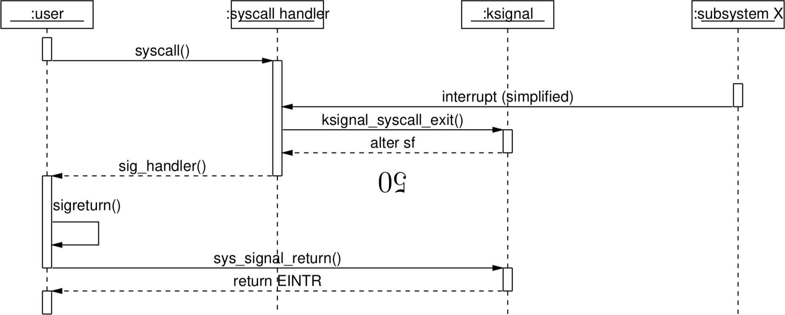

IPC - Inter-process Communication
=================================

Pipes
-----

Zeke supports unidirectional
POSIX
pipe
ipc.
The implementation inherits nofs and it utilizes `queue_r` to provide
lockess data transfer between a producer and a consumer. However, the
current implementation doesn’t guarantee the atomicity the requirement
set by
POSIX.
POSIX requires a transaction under `PIPE_BUF` bytes to be atomic.

Pseudo Terminals
----------------

A pseudo terminal is a interprocess communication channel that acts like
a terminal and looks like terminal. One end of the channel is the master
end and one end is the slave side of the channel. Pseudo terminals can
be used to implement terminal emulation functionality that looks like an
ordinary user terminal over
tty.

shmem
-----

shmem
is a part of the
ipc
subsystem providing shared memory between processes and also to some
device drivers like frame buffers.

The userland interface to shmem is provided by `sys/mman.h` and it’s
described in libc part of this book as well as in corresponding man
pages.

Signals
-------

The signal system is implemented to somewhat comfort with
POSIX
threads and process signaling. This means that signals can be sent to
both processes as well as threads. Signals are passed to signal
receiving entities in forwarding fashion, a bit like how packet
forwarding could work.

### Userspace signal handlers

Figure [\[figure:sigstack\]](#figure:sigstack) shows how entry to a user
space signal handler constructs necessary data on top of the user stack
and alters the thread stack frame.

**A signal stack and the new thread stack frame.**

Figure [\[figure:syscallint\]](#figure:syscallint) shows the signal
handling flow when a signal is received in a middle of a system call and
the system call is interrupted to immediately run the user space signal
hanlder.

**Interruption of a system call when a signal is caught**
